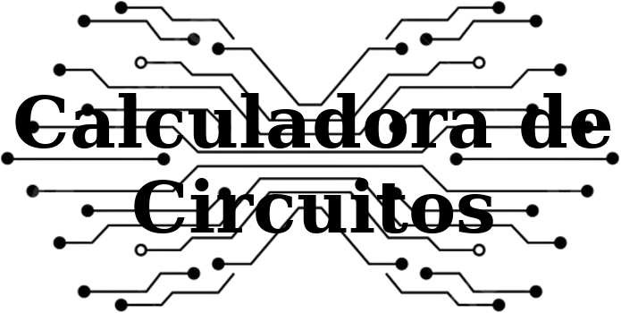
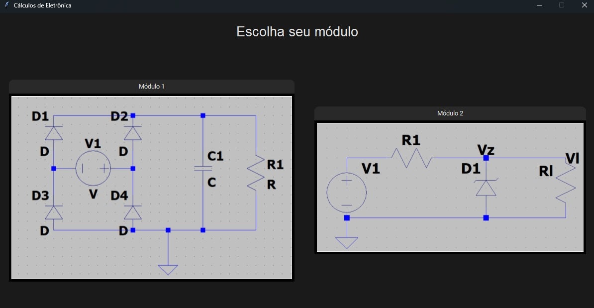
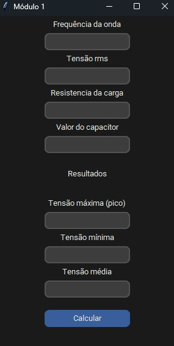
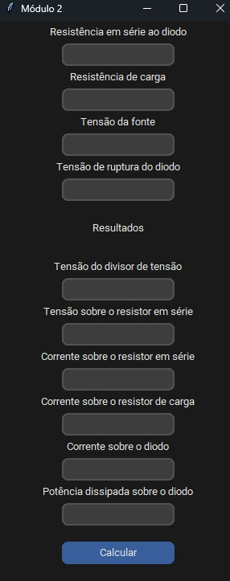
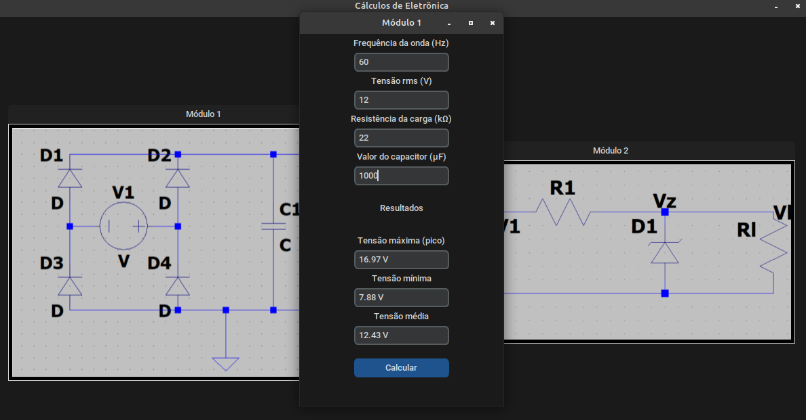

<div id="topo"></div>
 <!-- BANNER -->
<h1 align='center'>
    
</h1>

<!-- PROJECT SUBTITLE / SHORT DESCRIPTION -->
<h2 align='center'>Interface gráfica para cálculos de circuitos de diodos</h2>

<!-- BADGES -->
<div align="center">
<!--BADGE PYTHON VERSION -->
    
<!--BADGE LICENÇA -->
<!--    
-->
<!-- BADGE REPO SIZE -->
    
<!-- BADGE TOP LANGUAGE -->
<!--    
-->
<!-- BADGE LAST COMMIT -->
    
<!-- BADGE STATUS DO PROJETO -->
    
</div>

<!-- LINKS DE DEMONSTRAÇÃO E README -->
<h3 align='center'>:link:<a href='https://github.com/Carol42/calculadora-circuitos-diodos' target='_blank'> Acessar o repositório (GitHub)</a></h3>


<!-- SUMÁRIO / TABELA DE CONTEÚDOS -->
<details>
    <summary>Sumário</summary>
    <ol>
        <li><a href="#pushpin-sobre">Sobre</a></li>
        <li><a href="#camera_flash-capturas-de-tela">Capturas de Tela</a></li>
        <li><a href="#hammer_and_wrench-funcionalidades">Funcionalidades</a></li>
        <li><a href="#gear-funcionamento">Funcionamento</a></li>
        <li><a href="#wrench-tecnologias-e-recursos-utilizados">Tecnologias e recursos utilizados</a></li>
        <li><a href="#computer-como-baixar-e-rodar-o-projeto">Como baixar e rodar o projeto</a>
            <ul>
                <li><a href="#bulb-pré-requisitos">Pré requisitos</a></li>
                <li><a href="#bulb-passo-a-passo">Passo a passo</a></li>
            </ul>
        </li>
        <li><a href="#woman_technologist-man_technologist-desenvolvedores">Desenvolvedores</a></li>
    </ol>
</details>

<!-- DESCRIÇÃO LONGA -->
## :pushpin: Sobre
O projeto trata-se de uma calculadora com interface gráfica sobre circuitos com diodos.


<!-- BOTÃO PARA VOLTAR AO TOPO DA PÁGINA -->
<p align="right"><a href="#topo"></a></p>

## :camera_flash: Capturas de tela
<!-- SCREENSHOTS / GIFS DO PROJETO -->

- Tela Inicial
<div align="center">
    
</div>

- Telas dos módulos
<div align="center">
    
    
</div>

- Exemplo de resultado
<div align="center">
    
</div>

<!-- BOTÃO PARA VOLTAR AO TOPO DA PÁGINA -->
<p align="right"><a href="#topo"></a></p>

<!-- FUNCIONALIDADES JÁ IMPLEMENTADAS E A IMPLEMENTAR -->
## :hammer_and_wrench: Funcionalidades
- [x] Cálculo da Tensão Média de Ripple
  - Valores retornados:
    - [x] Tensão Máxima (pico)
    - [x] Tensão Mínima
    - [x] Tensão Média 
- [x] Cálculo da Potência Dissipada pelo Diodo Zener
  - Valores retornados:
    - [x] Tensão do Divisor de Tensão (sem levar em conta a tensão de ruptura do diodo)
    - [x] Tensão sobre o resistor em série
    - [x] Corrente sobre o resistor em série
    - [x] Corrente sobre o resistor de carga
    - [x] Corrente sobre o diodo
    - [x] Potência dissipada sobre o diodo

<!-- BOTÃO PARA VOLTAR AO TOPO DA PÁGINA -->
<p align="right"><a href="#topo"></a></p>


## :gear: Funcionamento

Funções utilizadas no sistema:
- Módulo 1:

```python
    # corrente
    i = rms/res

    # tensão de ripple
    vripple = i/freq*cap

    # tensão máxima
    max_volt = rms * sqrt(2)

    # tensão mínima
    min_volt = max_volt - vripple

    # tensão máxima
    avg_volt = (max_volt + min_volt)/2
```

- Módulo 2:
  
```python
    # Tensao do divisor de tensao
    div_w = w_fonte * (r_carga / (r_diodo + r_carga))

    # Tensao sobre o resistor em serie
    w_res_s = w_fonte - div_w

    # Corrente sobre o resistor em serie
    i_res_s = w_res_s / r_diodo

    # Corrente sobre o resistor de carga
    i_res_carga = w_diodo/r_carga

    # Corrente sobre o diodo
    i_diodo = i_res_s - i_res_carga

    # Potencia dissipada sobre o diodo
    pot_diodo = w_diodo * i_diodo
```

<!-- BOTÃO PARA VOLTAR AO TOPO DA PÁGINA -->
<p align="right"><a href="#topo"></a></p>

<!-- LINKS PARA LINGUAGENS / FRAMEWORKS / BIBLITECAS / RECURSOS / TECNOLOGIAS UTILIZADAS NO PROJETO -->
## :wrench: Tecnologias e recursos utilizados
- Linguagem de programação:
  - [Python](https://www.python.org/) - linguagem de programação utilizada no projeto
- Bibliotecas:
  - [Tkinter](https://docs.python.org/3/library/tkinter.html) - para criação da interface gráfica (GUI)
  - [CustomTkinter](https://customtkinter.tomschimansky.com/) - biblioteca que contém uma variedade de ferramentas de UI para desktop
  - [PyInstaller](https://pyinstaller.org/en/stable/) - para criação do arquivo executável
  - [VSCode](https://code.visualstudio.com/) - IDE gratuita e open source, utilizada para o desenvolvimento do projeto

<!-- BOTÃO PARA VOLTAR AO TOPO DA PÁGINA -->
<p align="right"><a href="#topo"></a></p>

<!-- INSTRUÇÕES DE COMO BAIXAR E RODAR O PROJETO, BEM COMO OS PRÉ REQUISITOS PARA TAL -->
## :computer: Como baixar e rodar o projeto

### :bulb: Pré requisitos

Antes de começar, você vai precisar ter instalado em sua máquina as seguintes ferramentas:

- [Git](https://git-scm.com), para clonar o repositório
- [Python3](https://www.python.org/), para ter acesso aos módulos básicos da linguagem, bem como o seu interpretador
- [pip](https://pypi.org/project/pip/), para instalar pacotes adicionais.

Além disso, é bom ter um editor para trabalhar com o código como o [VSCode](https://code.visualstudio.com/), por exemplo.

### :bulb: Passo a passo
```bash
# Clonar o repositório
$ git clone https://github.com/Carol42/calculadora-circuitos-diodos

# Entrar no diretório
$ cd calculadora-circuitos-diodos

# Instalar as dependências
$ pip install -r requirements.txt

# Iniciar o projeto
$ python3 calculadora.py
```
<!-- BOTÃO PARA VOLTAR AO TOPO DA PÁGINA -->
<p align="right"><a href="#topo"></a></p>

<!-- INFORMAÇÕES SOBRE OS DESENVOLVEDORES -->
## :woman_technologist::man_technologist: Desenvolvedores
<table>
<tr>
<td>
<a href="https://github.com/Carol42">
</a>
</br>
<strong>Caroline Heloíse de Oliveira</strong>
</br>
<sup>Engenharia de Computação (UEPG)</sup>
<br>
<a href="https://github.com/Carol42"></a>
<a href="https://linkedin.com/in/carol42"></a>
<a href="mailto:carol42.helo@gmail.com"></a>

</td>
<td>
<a href="https://github.com/dcfdl">
</a>
</br>
<strong>Davi Costa Ferreira da Luz</strong>
</br>
<sup>Engenharia de Computação (UEPG)</sup>
<br>
<a href="https://github.com/dcfdl"></a>
<a href="https://www.linkedin.com/in/davi-costa-ferreira-da-luz-070b53216"></a>
<a href="mailto:davicostaferreiradaluz@gmail.com"></a>
</td>
</tr>
</table>

</br></br>


<!-- BOTÃO PARA VOLTAR AO TOPO DA PÁGINA -->
<p align="right"><a href="#topo"></a></p>
